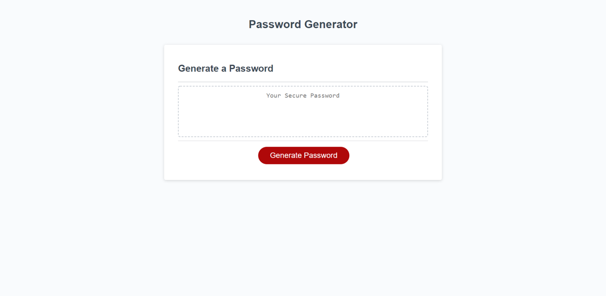

# JavaScript Challenge: Password Generator

## Description
This week’s challenge required me to create an application that an employee could use to generate a random password, between 8 and 128 characters in length, based on criteria they’ve selected - uppercase letters, lowercase letters, numbers, or special characters. This app will run in the browser, and will feature dynamically updated HTML and CSS powered by JavaScript code.

### Issues I Faced
I was able to get the code that asked the user what types of character options they wanted in their password to work, but found it difficult to get the code to generate the random password.  

### Website Link
https://brynne-eastman.github.io/JS-Password-Generator-Challenge/

### Screenshot

